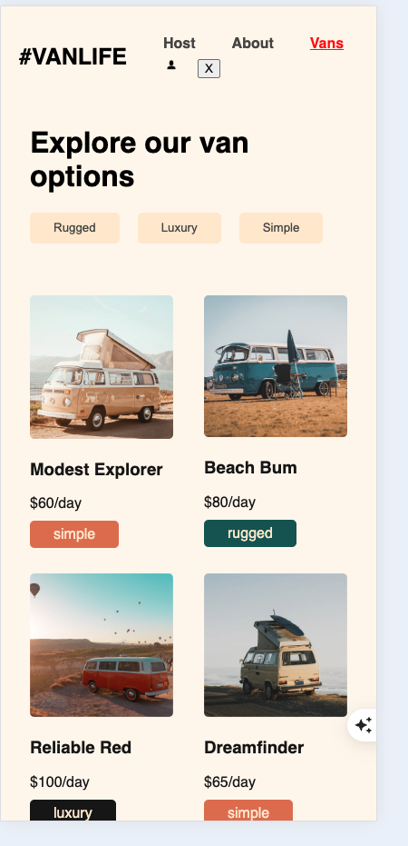
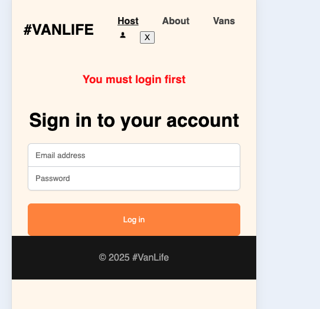
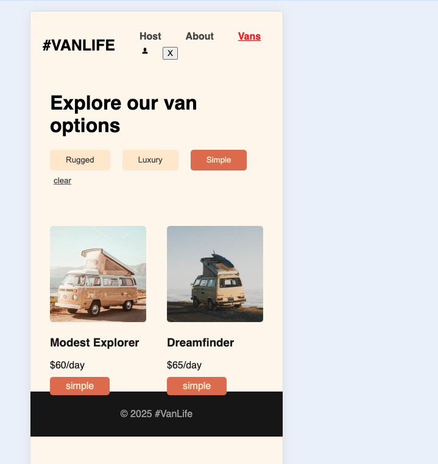

# 🚐 VanLife

VanLife is a React-based web application designed for van enthusiasts to explore, manage, and rent vans. The project demonstrates modern web development practices, including routing, state management, Firebase integration, and responsive design.

---

## 🌟 Features

### 1. **Van Listings**
   - Users can explore a variety of vans with filtering options based on categories like `Rugged`, `Luxury`, and `Simple`.
   - Each van displays its name, price, and category.

   

---

### 2. **Van Details**
   - Detailed information about each van, including pricing, photos, and specifications.
   - Nested routing is used to display additional details like pricing and photos.

---

### 3. **Host Dashboard**
   - A dedicated section for van hosts to manage their vans, view income, and read reviews.
   - Protected routes ensure only authenticated users can access this section.

---

### 4. **Authentication**
   - Firebase Authentication is used to manage user login and secure access to protected routes.
   - Users must log in to access the host dashboard.

   

---

### 5. **Filtering**
   - Users can filter vans by categories (e.g., `Rugged`, `Luxury`, `Simple`) to find the perfect match.
   - A "clear" button resets the filters.

   

---

### 6. **Responsive Design**
   - Fully responsive design ensures a seamless experience across devices.

---

## 🛠️ Technologies Used

### 1. **Frontend**
   - **React**: Component-based architecture for building the UI.
   - **React Router**: For client-side routing and nested routes.
   - **CSS**: Custom styles for a clean and modern design.

### 2. **Backend**
   - **Firebase Firestore**: A NoSQL database for storing van data.
   - **Firebase Authentication**: For secure user login and authentication.

### 3. **Other Tools**
   - **Environment Variables**: Sensitive Firebase configuration is stored in `.env` for security.
   - **Responsive Design**: Ensures compatibility across devices.

---

## 🚀 How to Run the Project

1. Clone the repository:
   ```bash
   git clone https://github.com/your-username/vanLife.git
   cd vanLife

2. Install dependencies:
   npm install

3. Create a .env file in the client directory and add your Firebase configuration:
<pre> REACT_APP_FIREBASE_API_KEY=your-api-key REACT_APP_FIREBASE_AUTH_DOMAIN=your-auth-domain REACT_APP_FIREBASE_PROJECT_ID=your-project-id REACT_APP_FIREBASE_STORAGE_BUCKET=your-storage-bucket REACT_APP_FIREBASE_MESSAGING_SENDER_ID=your-messaging-sender-id REACT_APP_FIREBASE_APP_ID=your-app-id </pre>

4. Start the development server:
    npm start
5. Open the app in your browser at http://localhost:3000.
<pre> vanLife/ ├── client/ │ ├── public/ │ │ └── screenshots/ # Images used in README │ ├── src/ │ │ ├── assets/ # Static images and assets │ │ ├── components/ # Shared UI components │ │ ├── pages/ # Route-based pages (e.g., Vans, Host) │ │ ├── firebaseSetup/ # Firebase config and initialization │ │ ├── App.js # Main app component │ │ └── index.js # React entry point ├── .env # Environment variables (not committed) ├── README.md └── package.json </pre>


## 🔒 Authentication
This project uses Firebase Authentication to secure routes and manage user sessions. Protected routes ensure that only logged-in users can access sensitive areas like the host dashboard.


## 🌐 Live Demo

Check out the live demo of the project here: [VanLife Live Demo](https://vanlifemode.netlify.app/)